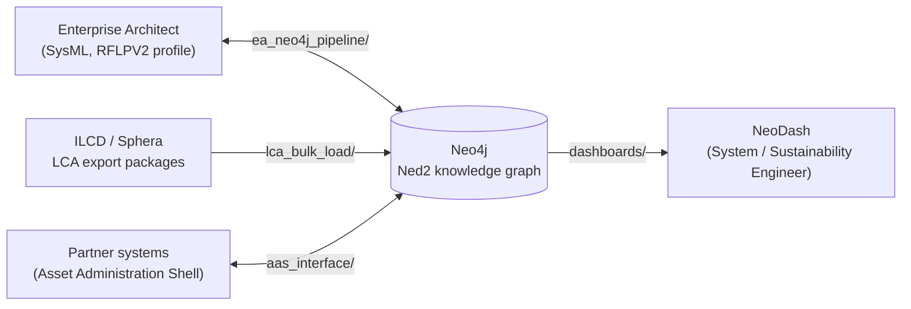

# DECODE

**D**ata **E**cosystems for **ECO**logical and **CO**llaborative **D**ecisions in **E**ngineering.

DECODE connects the tools engineers already use — SysML models in Enterprise
Architect, LCA data from ILCD/Sphera exports, Asset Administration Shells for
cross-organisation exchange — to a single Neo4j knowledge graph, so that
system-design decisions and sustainability data can be reasoned about
together instead of living in separate silos. The research demonstrator is a
Niryo Ned2 robot gripper: 43 design variants, their components, materials,
manufacturing processes, requirements, and life-cycle assessment results, all
in one graph.

> **Status:** the demonstrator graph currently holds **2,721 nodes** across
> **30 relationship types** (~79,600 relationships). All four interfaces
> below are built and verified end-to-end against real data — none of the
> numbers in this repository's documentation are estimates; every reproducibility
> claim was checked against a running Neo4j instance.

## Why a graph, and why these four interfaces

A sustainability decision in engineering rarely has one owner. A **System
Engineer** asks whether a design is reparable, scalable into variants, and
meets its requirements. A **Sustainability Engineer** asks what a variant's
environmental footprint is, and how trustworthy the numbers behind it are.
Both questions need the same underlying data — product structure, materials,
processes, impact assessments — just viewed differently. Keeping that data in
one graph, with each role's tool of choice reading from and writing back to
it, is the point of DECODE.

## The four interfaces

| Folder | What it does | Direction |
|---|---|---|
| [`ea_neo4j_pipeline/`](ea_neo4j_pipeline/) | A System Engineer designs the product (requirements, functions, logical solution principles, product structure) as a SysML model in Enterprise Architect, using a custom RFLPV2 profile; two scripts move that design into Neo4j and mirror the graph's current state back into EA. | EA ⇄ Neo4j |
| [`lca_bulk_load/`](lca_bulk_load/) | Turns raw ILCD/Sphera life-cycle-assessment export packages into the graph's process/flow/impact backbone — the bulk data load that seeds the demonstrator. | ILCD → Neo4j |
| [`aas_interface/`](aas_interface/) | Exchanges sustainability data with partner organisations as Asset Administration Shell instances, at three deliberately different transparency levels (White/Grey/Black Box), and imports them back. | Neo4j ⇄ AAS |
| [`dashboards/`](dashboards/) | Two role-specific NeoDash dashboards (System Engineer, Sustainability Engineer) that query the graph directly — no separate backend. | Neo4j → NeoDash |

Each folder has its own `README.md` with the concepts, the concrete data
shapes involved, and step-by-step reproduction instructions for that
interface specifically.

## Beyond the demonstrator

Two further folders build on the same graph but are about *methods* rather
than *interfaces*:

| Folder | What it does |
|---|---|
| [`model_extension/`](model_extension/) | A sequence of strictly additive, non-breaking Cypher migrations that grow the schema from a single hardwired impact assessment (black box) to a method-exchangeable one (white box) plus orthogonal method-family modules — LCA, carbon/water/GHG-by-scope, circularity, cost, scenario and cross-impact analysis. The "never breaks what came before" property is the flexibility argument. |
| [`methods/`](methods/) | The 29-method sustainability-assessment catalogue: one spec per method, plus tested read-only base queries. |

[`lca_bulk_load/incremental/`](lca_bulk_load/incremental/) adds a per-package
ILCD importer for attaching one extra dataset at a time after the bulk seed.

## Requirements

- Neo4j (Desktop or Aura), reachable via Bolt
- Python 3.10+ with `pip install neo4j` for the Python scripts
- PowerShell 5.1+ for the `.ps1` scripts (Windows; tested on Windows 11)
- Enterprise Architect (Sparx Systems) for `ea_neo4j_pipeline/`
- AASX Package Explorer for `aas_interface/`
- NeoDash for `dashboards/`

Neo4j credentials are **never** hardcoded or passed as script arguments in
this repository — every script reads `NEO4J_URI` / `NEO4J_USER` /
`NEO4J_PASSWORD` from environment variables you set yourself before running
it. See the respective folder READMEs for exact invocations.
