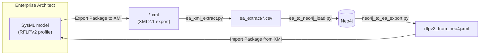

# EA ⇄ Neo4j pipeline

The primary DECODE workflow: a **System Engineer designs the product in
Enterprise Architect** — requirements, functions, logical solution
principles, product structure, verification/validation — using SysML and a
custom extension profile (**RFLPV2**), and pushes that design into the Neo4j
knowledge graph. A second script mirrors the graph's current state back into
an EA project, so the graph can also be the starting point for a design
session.

> **Status:** both directions verified end-to-end against real data —
> extraction against a real EA XMI export (`rflpv2_package.xml`, 15 elements,
> 20 stereotype applications, 5 dependencies), loading against a fresh test
> instance *and* against the production Ned2 instance (merge-onto-existing
> path), and the reverse export against the full production graph (271
> nodes, 129 composition edges, 330 relationships, structurally verified by
> round-tripping the generated file back through the extractor). See
> [`ea_to_neo4j_mapping.md`](ea_to_neo4j_mapping.md) for the complete,
> continuously-updated decision log behind every mapping rule below.



## Files

| File | Role |
|---|---|
| `RFLPV2_Extension_Profile_V009.xml` | The SysML extension profile: 26 stereotypes (requirements, functions, logical elements, product structure, verification/validation) with their tagged values. |
| `RFLPV2_Toolbox_v003.xml` | The EA toolbox (drag-and-drop palette) matching the profile 1:1. |
| `RFLPV2_MDG_v009.xml` | Profile + toolbox bundled into one importable MDG Technology file. |
| `rflpv2.qea` | Reference EA project with the profile/toolbox loaded and a hand-built test model — a starting point to see the stereotypes in use. |
| `ea_xmi_extract.py` | Parses an EA XMI 2.1 export into per-label/per-relationship CSVs, resolving GUIDs to business keys. |
| `ea_to_neo4j_load.py` | Loads those CSVs into Neo4j via the Bolt driver (`MERGE`-based, idempotent). |
| `neo4j_to_ea_export.py` | Reads the current graph and generates an XMI 2.1 file for bootstrapping a new EA project from it. |
| `rflpv2_merge_test.xml` | Hand-built XMI fixture (real Ned2 business keys) used to verify the merge-onto-existing-node path. |
| `ea_new_labels_constraints.cypher` | Uniqueness constraints for the labels this pipeline introduces (`CustomerNeed`, `TestCase`, `TestCaseDescription`, `TestScenario`, `Validation`, `Verification`). |
| `ea_to_neo4j_mapping.md` | The living specification: every stereotype→label mapping, every relationship rule, every empirically-discovered EA quirk, and the reasoning behind each decision. |

## Setup: getting the profile into EA

1. **Import the MDG Technology:** *Settings ▸ MDG Technologies ▸ Manage MDG
   Technologies ▸ Import Technology* → `RFLPV2_MDG_v009.xml`.
2. **Separately reimport the UML Profile:** *Resources ▸ UML Profiles ▸
   RFLPV2_Sustainability_Process_Extension ▸ Import Profile* → the profile
   file directly.

   > ⚠️ **Both steps are required, every time the profile changes.** This
   > was the single biggest source of confusion while building this
   > pipeline: importing the MDG Technology alone updates the toolbox but
   > does **not** reliably refresh the embedded UML Profile's live
   > registration, so connectors that should now be valid keep failing with
   > *"Invalid combination of source and target types for this connector
   > type"* even though the profile file itself is already correct. If a
   > relationship won't draw and the profile looks right on paper, redo step
   > 2 before debugging anything else.
3. Open/create a package, drag stereotyped elements from the toolbox, connect
   them with the profile's dependency stereotypes (`Derives`, `Satisfies`,
   `Realizes`, `Affects`, `Refines`, `Requires`, `Specifies`, `Validates`,
   `Verifies`) and SysML composition for product structure.

## Workflow: design in EA → Neo4j

1. Design the model in EA (see stereotype table below).
2. Export: *Project ▸ Model Exchange ▸ Export Package to Native/XMI File*,
   format **XMI 2.1**.
3. Extract:
   ```powershell
   cd ea_neo4j_pipeline
   python ea_xmi_extract.py --input <exported>.xml --out-dir ea_extract
   ```
4. Load (credentials only via environment variables, never as arguments):
   ```powershell
   $env:NEO4J_URI = "bolt://localhost:7687"
   $env:NEO4J_USER = "neo4j"
   $env:NEO4J_PASSWORD = "..."
   python ea_to_neo4j_load.py --extract-dir ea_extract
   ```
   Nodes are merged on their business-key `id` (existing nodes such as
   `FUNC_GRASP` get enriched, not duplicated); relationships are merged on
   `(from_id, to_id, type)`.

## Workflow: Neo4j → EA (bootstrap)

To start a design session from the graph's current state instead of an empty
project:
```powershell
python neo4j_to_ea_export.py --out rflpv2_from_neo4j.xml
```
Then in EA: *Project ▸ Model Exchange ▸ Import Package from XMI* →
`rflpv2_from_neo4j.xml`.

> ⚠️ EA's XMI import matches elements by GUID, not by business key. This
> script assigns deterministic GUIDs (`EAID_<businessKey>`), but an EA
> project that already has hand-authored elements with the same business
> keys (different, random GUIDs) will end up with **duplicates**, not
> merges, if you import into it. Use a fresh EA project for the bootstrap
> import.

The export includes **7 diagrams**, confirmed working end-to-end against a
real EA import: one Requirements diagram and six BDD diagrams (Functions,
Logical Elements, Product Structure, Processes, Test Cases, Test Scenarios)
— split by stereotype category rather than one large diagram, each laid out
in a simple grid (a starting point to clean up with EA's own "Layout
Diagram", not a finished layout). Only the Product Structure diagram draws
edges (the `HAS_COMPONENT` composition tree) — every dependency relationship
in this data model (`Realizes`, `Satisfies`, ...) connects two *different*
categories, so it can't be drawn on any single one of these diagrams; those
edges still exist fully in the model (visible per-element or via an EA
Relationship Matrix), just not as a line on one of the 7. Pass `--no-diagram`
to export bare model elements only, if the diagram blocks turn out to cause
import trouble.

## Stereotype → Neo4j label mapping (summary)

| RFLPV2 stereotype | Neo4j label | Business key |
|---|---|---|
| `Customer Need` | `:CustomerNeed` | `needID` |
| `Customer Requirement` | `:Requirement` (`level='customer'`) | `customerRequirementID` |
| `System Requirement` | `:Requirement` (`level='system'`) | `systemRequirementID` |
| `Function` | `:Function` | `functionID` |
| `Logical Element` | `:SolutionPrinciple` | `logicalID` |
| `Process Element` | `:Process` | `processID` |
| `Product Element` | `:Artifact` / `:Assembly` / `:Part`, derived from composition depth | `productID` |
| `Test Case` / `Test Case Description` / `Test Scenario` | `:TestCase` / `:TestCaseDescription` / `:TestScenario` | respective `*ID` tag |
| `Validation` (+ `Analysis`/`Demonstration`/`Inspection`/`Simulation`/`Test`) | `:Validation` | `validationID` |
| `Verification` | `:Verification` | `verificationID` |

Dependency stereotypes map to relationship types (`Satisfies` →
`:SATISFIES_REQUIREMENT`, `Realizes` → `:REALIZES_FUNCTION` /
`:REALIZES_PRINCIPLE`, others to their own new type); SysML composition
between `Product Element`s becomes the `:HAS_COMPONENT` tree that also
determines the Artifact/Assembly/Part split. Full rules, fallback behaviour,
and every edge case (materials, process references, verification methods)
are in [`ea_to_neo4j_mapping.md`](ea_to_neo4j_mapping.md).

## Known, deliberate gaps

Not every Neo4j property has a home in the current profile, and the reverse
export deliberately leaves these out rather than guessing a mapping: free
text (`Requirement.statement` — EA's Notes-field XMI encoding has never been
verified for writing), qualitative fields with no numeric equivalent
(`Requirement.priority` is `must`/`should` in Neo4j, but the profile's
`requirementPriority` tag is typed `Real`), and various provenance/measurement
fields on `Function`/`Process`/product-structure nodes. These stay in Neo4j;
they just don't round-trip through EA yet.
