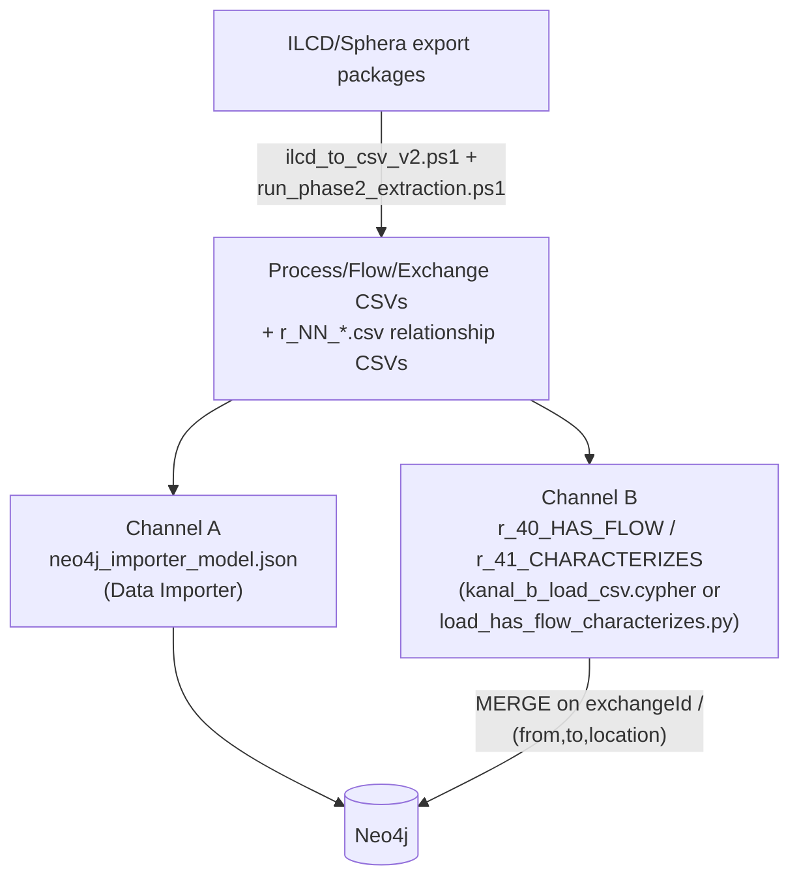

# LCA bulk load (ILCD/Sphera → Neo4j)

Turns raw ILCD-format life-cycle-assessment export packages (from Sphera, or
any ILCD-compliant LCA tool) into the process/flow/impact backbone of the
Ned2 knowledge graph. This is the bulk seed data load — run once (or
whenever the LCA data source set changes), as opposed to the incremental,
role-driven updates the other three interfaces make.

> **Status:** fully verified on a local Neo4j Desktop instance — **2,721
> nodes**, **79,642 relationships across 30 types**, every type checked
> against its expected count. 17 manufacturing/energy/end-of-life processes
> selected from 72 available (screws, adhesive, aluminium, steel,
> electricity, polyamide, one end-of-life package) as plausible candidates
> for building the gripper variants — selection criterion: plausibly
> relevant to manufacturing the gripper/robot-arm alternatives, explicitly
> excluding pure recycling/scrap-credit line items, textile fibres,
> construction-grade steels, gas/water as process energy (no matching
> process step in the model), and bitumen adhesive.

## Why two channels

The Neo4j Data Importer merges relationships purely on `(from, to, type)` —
it cannot express a relationship key. Most of this data model doesn't need
one, but `HAS_FLOW` and `CHARACTERIZES` do: the same process can have several
parallel `HAS_FLOW` edges to the same flow (e.g. country-specific
characterisation factors), and the same flow can have several `CHARACTERIZES`
edges to the same impact category. Loading those through the Data Importer
silently collapses them. Splitting the load into two channels solves it:



- **Channel A** — everything except `HAS_FLOW`/`CHARACTERIZES`, loaded
  through the Data Importer as usual from `neo4j_importer_model.json` and the
  regular CSVs. These two relationship types are **completely absent** from
  Channel A's schema (not even as unmapped documentation — the Data Importer
  refuses to open a model where any declared type lacks a full mapping).
- **Channel B** — `r_40_HAS_FLOW_Process_TO_Flow.csv` and
  `r_41_CHARACTERIZES_Flow_TO_ImpactCategory.csv`, loaded separately via
  `kanal_b_load_csv.cypher` (local `LOAD CSV`) or `load_has_flow_characterizes.py`
  (Bolt driver, for Aura or any remote instance — credentials via environment
  variables only, same convention as the rest of DECODE). Merge keys:
  `exchangeId` (globally unique, format `<processId>#<dataSetInternalID>`)
  for `HAS_FLOW`; `(from, to, location)` for `CHARACTERIZES`.

## Reproducing the load

1. **Extract** ILCD packages to CSV:
   ```powershell
   ./run_phase2_extraction.ps1   # orchestrates ilcd_to_csv_v2.ps1 across all source packages
   ```
   Note: characterisation factors live in a **separate** `LCIAMethod` dataset
   (its own XML namespace), not inside the `Process` dataset — they are
   filtered to only the flow UUIDs actually used, not pulled wholesale.
2. **Map raw UUIDs to readable IDs**: `build_process_id_map.ps1`,
   `build_category_id_map.ps1` (name-based matching between fresh ILCD
   extractions and the existing catalogue's IDs, e.g. `IC_EF_LAND_USE`).
3. **Merge/dedupe sources**: `merge_all_sources.ps1`.
4. **Load Channel A** through the Neo4j Data Importer using
   `ned2_gripper_full_model_neo4j/neo4j_importer_model.json` and its CSVs
   (`assemble_kanal_a.ps1` / `build_zip_v2.ps1` build the importer package;
   `patch_importer_model.ps1` / `validate_json_patch.ps1` are the tools used
   to evolve that schema file itself when its structure needs to change —
   not a step you normally run for a plain data reload).
5. **Load Channel B**:
   ```powershell
   $env:NEO4J_URI = "bolt://localhost:7687"; $env:NEO4J_USER = "neo4j"; $env:NEO4J_PASSWORD = "..."
   python load_has_flow_characterizes.py
   ```
   or, against a local instance, run `kanal_b_load_csv.cypher` via
   `cypher-shell` with the two CSVs in the DBMS's `import` folder.
6. **Constraints**: `add_constraints.cypher` (idempotent, already embedded in
   both channel-B loaders — a manual run is only needed once against a fresh
   instance that skipped them).

`full_init.cypher` / `reset_to_blank.cypher` cover a clean rebuild from
scratch against an empty database.

### Adding one more package later

[`incremental/`](incremental/) has a Python importer for attaching a **single**
extra ILCD process package (one polymer, one metal, one grid mix) to a material
after the bulk seed is in place, without re-running this whole pipeline. It
harmonises the new package's flow nomenclature onto the graph's existing
`CHARACTERIZES` factors by CAS number. No ILCD packages are committed — see that
folder's README.

## Data-quality fixes worth knowing about

These are one-off corrections already applied to the current dataset, kept
here for reference and because a future re-extraction from raw ILCD sources
would need to reapply the same logic:

- `close_upstream_gap_proc_cnc.cypher` / `close_upstream_gap_assembly_finish.cypher`
  — some engineering processes (e.g. `PROC_CNC`) had `HAS_FLOW` edges to
  generic placeholder flows with no upstream `CHARACTERIZES` chain, because
  they're intermediate-product flows rather than elementary flows. These
  scripts rewire them onto the matching ILCD library process so impact
  values actually compute instead of returning `NULL`.
- `rename_legacy_exchange_ids.cypher` + `legacy_exchange_ids.txt` —
  unifies two historically-coexisting `exchangeId` conventions onto the
  standard `<processId>#<N>` format, keeping the old value as
  `legacyExchangeId`.
- `fix_dq_issues.cypher` — assorted data-quality corrections found while
  building downstream queries (e.g. a property that held density values
  where a percentage was expected).
- `diagnose_*.cypher`, `isolated_*_test.cypher` — diagnostic queries kept
  from tracking down a reproducible Data Importer inconsistency where two
  relationship types (`APPLIES_TO`, `EVALUATES_CRITERION`) came up short on
  a full-script run; deleting and reloading just those two types afterward
  reliably fixes it (root cause not fully identified — a batching/index
  timing effect on the full script, not a data problem). `gen_reload_inline.ps1`
  generates the corresponding reload script, `reload_applies_to_evaluates_criterion.cypher`,
  from a Channel A build directory — an inline-`UNWIND` fallback variant for
  targets (e.g. Aura) where `LOAD CSV` isn't an option.

## One-time historical scripts

`fix_legacy_exchange.ps1` and `gen_reload_inline.ps1` (see above) were each
written for one specific, already-applied migration and aren't part of the
regular reload path above — they're kept for provenance/auditability, not as
reusable tooling. `fix_legacy_exchange.ps1` in particular is tied to a
schema state (the removed `Exchange` node type) that no longer exists in
the current model. All scripts in this folder read their input/output paths
from local variables at the top of the file — adjust them to your own
environment before running any of them; none are hardcoded to a specific
machine or person.
