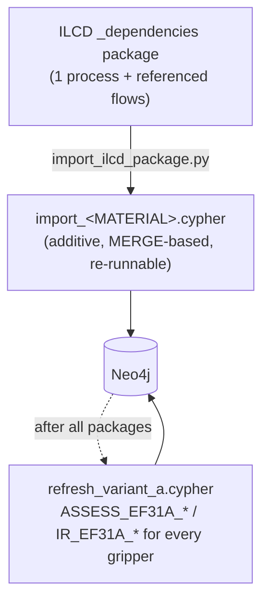

# Incremental ILCD import (one package at a time)

The bulk load one directory up seeds the graph's process/flow/impact backbone
from a fixed set of Sphera packages, all extracted and merged in one pass.
This sub-folder is for the case that comes up **after** that: you have a single
extra ILCD process — one polymer, one metal, one grid mix — that you want to
attach to a material and have compute through the graph's existing EF3.1
characterisation, without re-running the whole bulk pipeline.

> **Status:** the Python importer is a faithful port of the shell/Perl
> prototype it replaces — verified to produce byte-identical import Cypher on
> the same input package, and the resulting graph reproduces the prototype's
> per-kg GWP figures exactly (ABS 3.14, PC 4.19, POM 3.26, PA 6.6 6.48
> kg CO2e/kg, all checked against a running Neo4j instance). The aluminium
> control value is unchanged by any import (9.67 kg CO2e/kg).

## Input

An **ILCD `_dependencies` package** — what an ILCD-compliant node
(`*.lca-data.com`, the JRC EPLCA network, Sphera's export) hands you when you
ask for one process *with its dependencies*: a single `ILCD/processes/*.xml`
plus every `ILCD/flows/`, `ILCD/flowproperties/`, `ILCD/unitgroups/`,
`ILCD/sources/`, `ILCD/contacts/` file it references. Either the `.zip` or an
already-unpacked directory works.

**No such package is committed to this repository.** ILCD data is the user's to
obtain under whatever terms apply to their source; the demonstrator was built
against the freely redistributable PlasticsEurope eco-profiles, but that is a
decision each user makes for their own data. `example/` contains a tiny
hand-written synthetic package (three flows) so the tooling can be exercised
with nothing licensed.

## What the import does



The generated Cypher, in order:

| # | Step |
|---|---|
| 1 | `MERGE (:Process)` with ILCD metadata — `datasetUuid`, `dataSetVersion`, `referenceYear`, `geographicalLocation`, `dataSetType`, `lifecycleModule:'A1-A3'`, `provenance:'ILCD-package-import'` |
| 2 | `MERGE (:Flow)` for every referenced flow **not already in the graph** (`name`, `casNumber`, `flowType`); existing flows are reused by UUID |
| 3 | `MERGE (:Process)-[:HAS_FLOW {amount, direction, compartment, unit}]->(:Flow)` for every exchange except the reference product; `compartment` is parsed from the exchange's short description (`emission/air`, `resource/ground`, …) |
| 4 | **Characterisation harmonisation.** Older eco-profile packages label the impact-driving emissions as `carbon dioxide (Emissions to air, unspecified)` etc.; the graph's `CHARACTERIZES` factors hang off the canonical `carbon dioxide (fossil)` variant. For emission flows that carry a CAS number but no `CHARACTERIZES` edge, the factors are copied from an already-characterised flow with the **same CAS and the same broad compartment** — biogenic↔biogenic guarded, land-use CO₂ excluded. Copied edges are tagged `derived:true`. |
| 5 | **Override** for the two ambiguous cases CAS 124-38-9 (CO₂) and 74-82-8 (CH₄): the "unspecified" emission is bound to the *fossil* factor. |
| 6 | `MERGE (:Material)-[:MODELED_BY {proxy, proxyRationale, datasetUuid, dataVariant:'A-realdataset', lifecycleModule:'A1-A3'}]->(:Process)` |
| 7 | Verification `RETURN`: per-kg GWP and the flow count that carried a climate factor |

Newer ILCD re-exports already use the canonical flow names/UUIDs, so steps 4–5
match nothing and are a harmless no-op — the same script handles both vintages.

### Known limits

- Flows **without a CAS number** (particulate matter, NMVOC, COD/BOD) are not
  reached by the CAS copy, so the particulate-matter and part of the
  photochemical-ozone category stay incomplete for a freshly imported dataset.
- EF3.1 gives chloride discharges to freshwater a large CTUe; on polymer
  datasets that dominates freshwater ecotoxicity. This is method-inherent, not
  an import artefact.
- Variant A is **material cradle-to-gate (A1–A3 of the polymer/metal)**. The
  gripper's own part forming (CNC/FFF/MJF electricity) is not included — that
  is what Variant B (`../../model_extension/migrations/v2_data/`) adds.

## Reproduction

```bash
# 1. one package -> import Cypher
python import_ilcd_package.py path/to/<uuid>_dependencies.zip \
    --material MAT_ABS \
    --proc-id  PROC_ABS_PLASTICSEUROPE_EF \
    --proxy    false \
    --rationale "PlasticsEurope ABS eco-profile, EU-27 2010, cradle-to-gate A1-A3" \
    --out import_MAT_ABS.cypher

# 2. apply it (local instance)
cypher-shell -a "$NEO4J_URI" -u "$NEO4J_USER" -p "$NEO4J_PASSWORD" -f import_MAT_ABS.cypher

#    ...or let the script load it directly over Bolt (Aura, remote):
export NEO4J_URI=bolt://localhost:7687 NEO4J_USER=neo4j NEO4J_PASSWORD=...
python import_ilcd_package.py path/to/pkg --material MAT_ABS --proc-id PROC_ABS_PLASTICSEUROPE_EF \
    --proxy false --rationale "..." --load

# 3. after importing every package you want, refresh the Variant-A results
cypher-shell -a "$NEO4J_URI" -u "$NEO4J_USER" -p "$NEO4J_PASSWORD" -f refresh_variant_a.cypher
```

Smoke test with nothing licensed:

```bash
python import_ilcd_package.py example --material MAT_EXP --proc-id PROC_EXP_EXAMPLE \
    --proxy false --rationale "synthetic smoke-test" --out /tmp/import_MAT_EXP.cypher
```

Credentials are read from `NEO4J_URI` / `NEO4J_USER` / `NEO4J_PASSWORD` only —
never passed as arguments, same convention as the rest of DECODE.

## Files

| File | Purpose |
|---|---|
| `import_ilcd_package.py` | parse one ILCD package → additive import Cypher (`--load` optionally executes it via the Bolt driver) |
| `refresh_variant_a.cypher` | recompute `ASSESS_EF31A_*` / `IR_EF31A_*` over every gripper whose material now has a `MODELED_BY` dataset |
| `example/` | minimal synthetic ILCD package (3 flows), for exercising the tooling without any licensed data |
